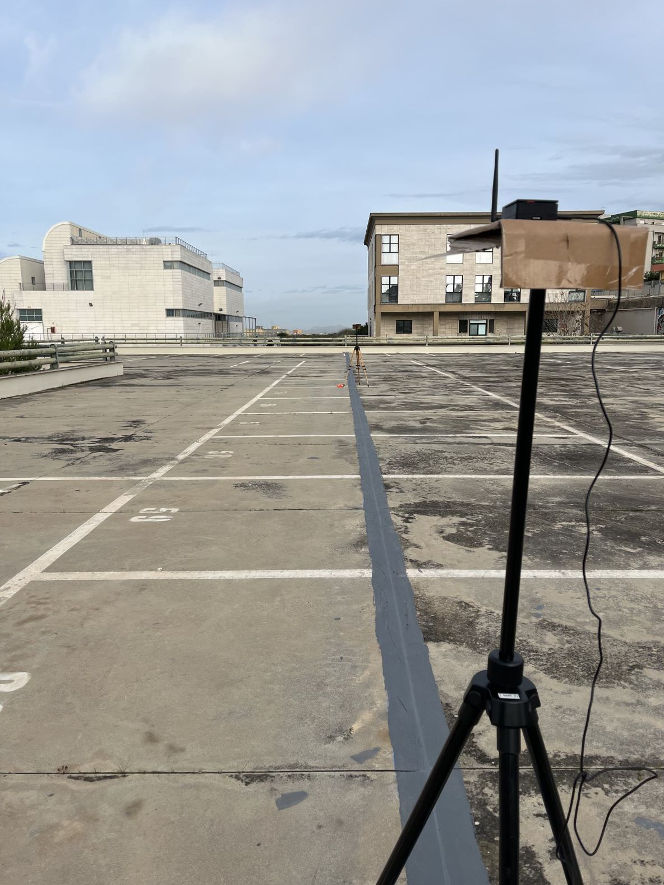

# RSS Dataset for Outdoor Localization Algorithms
This dataset is a complete set of Received signal strength (RSS) reads collected by a Target Raspberry Pi 4 model B node using an external WiFi interface that is intended to capture probe requests sent by anchor nodes Raspberry Pi Zero W located in the scenario.
For conducting the tests, a scenario was created in the outdoor parking lots of the Faculty of Engineering, University of Cagliari. 
Six anchor nodes distributed along a rectangle of size 21.1 x 30 meters, as shown in the figure, were used for the acquisitions. 

  <b> Experimental scenario </b>

The purpose of this dataset is to provide real RSS measurements, thus affected by propagation disturbances such as typical of these scenarios, by means of which to be able to test RSS-based localization algorithms. 
The dataset consists of 6 columns, named Timestamp, Date ISO, Rx Power [dBm], Relative Coordinates [m], Target Coordinates [m], Distance Target - Anchor [m], respectively. The Timestamp and Date ISO data refer to the time instant at which the Target node acquires the probe request to which the Rx Power [dBm] data refers. The data Relative Coordinates [m] refers to the coordinates of the anchor node in the reference scenario while Distance Target - Anchor [m] refers to the distance between the anchor node and the target node. The data element Target Coordinates [m] refers to the relative coordinates of the target in the reference scenario. 

## Devices
Two types of devices were used to conduct the acquisition campaign: Raspberry Pi 4 model B for the Target node, Raspberry Pi Zero W for the anchor nodes.

  <b> Anchor and Target devices </b>

The Target node was equipped with an external WiFi interface that would allow it to sniff the network and consecutively capture probe requests sent by the anchor nodes. From the capture of these frames, various information can be extracted, including the RSS on which we focus in this work. 
To perform the captures, all devices were placed on a tripod at a height of 1.5 meters above the ground as can be seen in the figure. This choice was made after conducting various tests at different heights that showed that better results could be obtained using this configuration.

  <b> Experimental setup </b>

